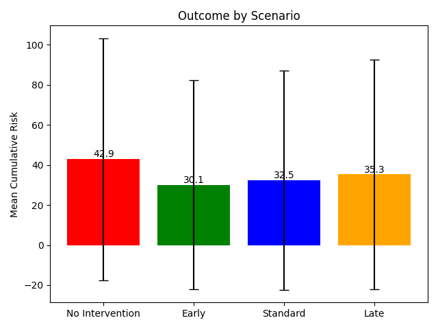

# Counterfactual Risk Trajectory Modelling

> Modelling patient deterioration as a temporal trajectory problem to understand how intervention timing shapes risk outcomes.

## Overview

This project simulates patient deterioration trajectories and evaluates how the timing of clinical interventions influences cumulative risk over time.

Rather than treating risk as a static score, the aim is to explore risk as a temporal process, and to examine how intervention timing alters downstream patient trajectories.

The project provides a simple but extensible framework for:
 
- generating synthetic patient time series data  
- modelling physiological instability  
- simulating interventions at different time points  
- comparing counterfactual outcomes across scenarios  

---

## Project Pipeline


## Motivation

In many clinical settings, decisions are made based on snapshot observations, despite deterioration being inherently dynamic.

This project explores a central question:

**To what extent does earlier intervention reduce the cumulative burden of patient risk over time?**

By simulating trajectories under different intervention timings, the model approximates how delays in action may translate into increased patient instability.

---

## Methodology

### 1. Data Generation

Synthetic patient data is generated for two groups:

- Stable patients with low variability  
- Deteriorating patients with progressive and non-linear worsening  

Each patient trajectory is simulated over a 90 day period, from Day 0 to Day 90.

Each patient includes longitudinal measurements of:

- heart rate  
- respiratory rate  
- oxygen saturation  

---

### 2. Risk Model

A simple linear instability score is derived from physiological variables:

- higher heart rate increases risk  
- higher respiratory rate increases risk  
- lower oxygen saturation increases risk  

The weighting loosely reflects prioritisation seen in early warning systems such as NEWS2, although this model is not clinically validated.

---

### 3. Intervention Simulation

Each deteriorating patient is replicated into counterfactual scenarios within the same 90 day trajectory:

- No intervention  
- Early intervention at day 30  
- Standard intervention at day 45  
- Late intervention at day 60  

Interventions are applied at fixed time points, and patient risk is observed until Day 90 to capture downstream effects on cumulative risk.

Interventions are modelled as gradual improvements in physiological variables rather than immediate corrections.

---

### 4. Outcome Metric

Risk is aggregated over time using a cumulative measure:

**Cumulative Risk = sum of risk values over time**

This acts as a proxy for total patient instability and overall burden of deterioration.

---

## Results

Average cumulative risk across deteriorating patients:

| Scenario | Mean Risk | Standard Deviation | Reduction vs No Intervention |
|---------|----------|-------------------|------------------------------|
| No Intervention | 42.94 | 60.40 | 0.00%                        |
| Early | 30.08 | 52.12 | 29.96%                       |
| Standard | 32.45 | 54.82 | 24.43%                       |
| Late | 35.31 | 57.31 | 17.78%                       |

---

## Key Insight

Earlier intervention consistently reduces cumulative patient risk, not by changing the trajectory itself, but by shortening exposure to instability.

Timing, not just detection, is a critical driver of patient outcomes.

## Results Visualisation (Example Outcome Comparison)



## Key Findings

- Intervention reduces cumulative patient risk  
- Earlier intervention produces the greatest reduction  
- Delayed intervention reduces effectiveness  
- There is substantial variability between patients  

The same underlying patient trajectory can produce significantly different outcomes depending on intervention timing, highlighting timing as a critical determinant of risk burden.

---

## Visual Outputs

The project generates the following visualisations:

- stable versus deteriorating trajectory comparisons  
- no intervention versus standard intervention trajectories  
- intervention timing comparisons  
- population level outcome comparisons  

All outputs are saved in the `outputs` directory.

---

## Project Structure

```
counterfactual_risk_trajectory/

├── assets/
│   └── pipeline.png
│
├── data/
│   ├── base_patient_data.csv
│   └── scenario_data.csv
│
├── outputs/
│   ├── stable_vs_deteriorating.png
│   ├── no_intervention_vs_standard_intervention.png
│   ├── intervention_timing_comparison.png
│   ├── outcome_by_scenario.png
│   └── summary_metrics.csv
│
├── src/
│   ├── generate_data.py
│   ├── risk_model.py
│   ├── intervention.py
│   ├── experiments.py
│   ├── outcomes.py
│   ├── visualise.py
│   └── main.py
│
├── README.md
└── requirements.txt

```


---

## Limitations

- The risk model is a simplified linear approximation and is not clinically validated  
- Synthetic data does not fully capture real-world complexity
- Interventions are modelled generically and do not reflect specific treatments  
- Temporal dynamics are simplified and do not include external clinical factors  

---

## Future Work

- Apply the framework to real clinical datasets  
- Replace the risk model with machine learning or probabilistic models  
- Personalise intervention timing at the patient level  
- Introduce multi-intervention strategies and feedback loops  
- Extend the framework towards decision-aware modelling, where risk is adjusted based on the potential impact and preventability of intervention (e.g. integration with Preventability-Adjusted Risk concepts) 

---


## Summary

This project demonstrates that modelling deterioration as a temporal process allows for direct evaluation of intervention timing, showing that earlier action can significantly reduce cumulative patient risk.

--- 

## How to Run

```bash
pip install -r requirements.txt
python src/main.py
```

## Author

Marlene "Lee" Yabele 

