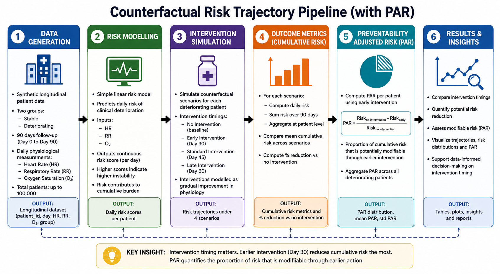
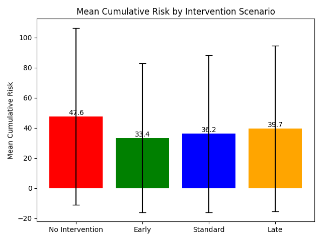
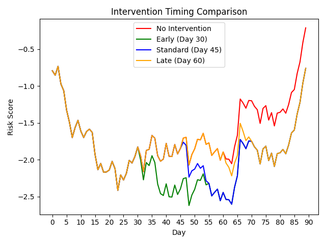

# Counterfactual Risk Trajectory Modelling

A simulation framework for temporal risk modelling and intervention timing analysis

> Modelling patient deterioration as a temporal trajectory problem to understand how intervention timing shapes risk outcomes.

## Overview

This project simulates patient deterioration trajectories and evaluates how the timing of clinical interventions influences cumulative risk over time.

Rather than treating risk as a static score, the aim is to explore risk as a temporal process, and to examine how intervention timing alters downstream patient trajectories.

The project provides a simple but extensible framework for:
 
- generating synthetic patient time series data  
- modelling physiological instability  
- simulating interventions at different time points  
- comparing counterfactual outcomes across scenarios

Although demonstrated using synthetic data, the framework is designed to be compatible with observational healthcare datasets and can be extended to OMOP CDM structured data environments.

---

## Project Pipeline



## Motivation

In many clinical settings, decisions are made based on snapshot observations, despite deterioration being inherently dynamic.

This project explores a central question:

**To what extent does earlier intervention reduce the cumulative burden of patient risk over time?**

By simulating trajectories under different intervention timings, the model approximates how delays in action may translate into increased patient instability.

Understanding the temporal impact of delayed intervention is particularly relevant for early warning systems and escalation protocols in hospital settings.

---

## Methodology

### 1. Data Generation

Synthetic patient data is generated for two groups:

- Stable patients with low variability  
- Deteriorating patients with progressive and non-linear worsening  

Synthetic data are used to isolate temporal dynamics and intervention effects in a controlled setting; however, the framework is structured to allow substitution with real-world longitudinal patient data.

Each patient trajectory is simulated over a 90 day period, from Day 0 to Day 90.

Each patient includes longitudinal measurements of:

- heart rate  
- respiratory rate  
- oxygen saturation  

---

### 2. Risk Model

A simple linear instability score is derived from physiological variables:

- higher heart rate increases risk  
- higher respiratory rate increases risk  
- lower oxygen saturation increases risk  

The weighting loosely reflects prioritisation seen in early warning systems such as NEWS2, although this model is not clinically validated.

---

### 3. Intervention Simulation

Each deteriorating patient is replicated into counterfactual scenarios within the same 90 day trajectory:

- No intervention  
- Early intervention at day 30  
- Standard intervention at day 45  
- Late intervention at day 60  

Interventions are applied at fixed time points, and patient risk is observed until Day 90 to capture downstream effects on cumulative risk.

Interventions are modelled as gradual improvements in physiological variables rather than immediate corrections.

---

### 4. Outcome Metric

Risk is aggregated over time using a cumulative measure:

**Cumulative Risk = sum of risk values over time**

This acts as a proxy for total patient instability and overall burden of deterioration.

---

## Results

Average cumulative risk across deteriorating patients:

| Scenario        | Mean Cumulative Risk | Standard Deviation | Reduction vs No Intervention |
|-----------------|----------------------|--------------------|------------------------------|
| No Intervention | 47.64                | 58.76              | 0.00%                        |
| Early           | 33.42                | 49.45              | 29.85%                       |
| Standard        | 36.19                | 52.18              | 24.03%                       |
| Late            | 39.68                | 54.97              | 16.72%                       |

Across the largest cohort (n = 100,000), the mean PAR was approximately 0.50.

Values shown correspond to a single simulation run (n = 100,000); minor variation may occur across repeated runs due to stochastic data generation.

---

### Scaling and Robustness

To evaluate the stability of the model, simulations were conducted across increasing cohort sizes:

- n = 50 (proof of concept)  
- n = 50,000 (stability)  
- n = 100,000 (robustness)  

Across all cohort sizes, the relative reduction in cumulative risk remained consistent:

- Early intervention: approximately 29–30% reduction  
- Standard intervention: approximately 23–24% reduction  
- Late intervention: approximately 16–18% reduction  

This consistency indicates that the observed effects are driven by the underlying model structure rather than sampling variability, supporting the robustness of the simulation framework.

Visualisations presented are based on the largest cohort (n = 100,000) for clarity, with smaller cohorts demonstrating equivalent directional behaviour.

As the data are synthetic and the model deterministic in structure, variability is constrained, which contributes to the stability of observed effects.

---

## Key Insight

Earlier intervention consistently reduces cumulative patient risk by shortening exposure to physiological instability, even when the underlying deterioration trajectory remains unchanged.

Timing, not just detection, is a critical driver of patient outcomes.

### Preventability Adjusted Risk (PAR)

To extend the analysis beyond cumulative risk, a Preventability Adjusted Risk (PAR) metric was introduced.

PAR is defined as the proportion of cumulative risk reduced under early intervention relative to no intervention:

PAR = (Cumulative Risk_no_intervention − Cumulative Risk_early) / Cumulative Risk_no_intervention

PAR is calculated at the patient level and summarised across the cohort.

Across the largest cohort (n = 100,000), the mean PAR was approximately 0.50, indicating that approximately half of the model-derived cumulative risk in deteriorating patients is modifiable under earlier intervention within the simulation framework.

This highlights an important distinction between predicted risk and modifiable risk, demonstrating that not all observed risk in this simulation is equally preventable and that intervention timing plays a critical role in determining the extent of achievable risk reduction.

As PAR is derived from a simulation-based framework, it reflects model-dependent modifiability rather than causal effect estimation.

This metric provides a model-based estimate of modifiable risk and is intended as an exploratory analytical construct rather than a causal measure.

---

## Results Visualisation 

### Outcome Comparison (Population Level)



### Intervention Timing (Single Patient Example)



## Key Findings

- Intervention reduces cumulative patient risk  
- Earlier intervention produces the greatest reduction  
- Delayed intervention reduces effectiveness  
- There is substantial variability between patients  

The same underlying patient trajectory can produce significantly different outcomes depending on intervention timing, highlighting timing as a critical determinant of risk burden.

---

## Visual Outputs

The project generates the following visualisations:

- stable versus deteriorating trajectory comparisons  
- no intervention versus standard intervention trajectories  
- intervention timing comparisons  
- population level outcome comparisons  

All outputs are saved in the `outputs` directory.

PAR metrics are included within the summary_metrics output files.

---

## Project Structure

```
counterfactual_risk_trajectory/

├── assets/
│   └── pipeline.png
│
├── data/
│   ├── base_patient_data.csv
│   └── scenario_data.csv
│
├── outputs/
│   ├── stable_vs_deteriorating_100k.png
│   ├── no_intervention_vs_standard_intervention_100k.png
│   ├── intervention_timing_comparison_100k.png
│   ├── outcome_by_scenario_100k.png
│   ├── summary_metrics_50.csv
│   ├── summary_metrics_50k.csv
│   └── summary_metrics_100k.csv
│
├── src/
│   ├── generate_data.py
│   ├── risk_model.py
│   ├── intervention.py
│   ├── experiments.py
│   ├── outcomes.py
│   ├── visualise.py
│   └── main.py
│
├── README.md
└── requirements.txt

```


---

## Limitations

- The risk model is a simplified linear approximation and is not clinically validated  
- Synthetic data does not fully capture real-world complexity
- Interventions are modelled generically and do not reflect specific treatments  
- Temporal dynamics are simplified and do not include external clinical factors  
- The framework has not yet been validated using real-world observational data (e.g. OMOP CDM), and findings should be interpreted as simulation-based insights rather than empirical estimates.

---

## Future Work

- Apply the framework to real clinical datasets  
- Replace the risk model with machine learning or probabilistic models  
- Personalise intervention timing at the patient level  
- Introduce multi-intervention strategies and feedback loops  
- Extend the framework towards decision-aware modelling, where risk is adjusted based on the potential impact and preventability of intervention (e.g. integration with Preventability-Adjusted Risk concepts) 

---


## Summary

This project demonstrates that modelling deterioration as a temporal process allows for direct evaluation of intervention timing, showing that earlier action can significantly reduce cumulative patient risk.

The inclusion of Preventability Adjusted Risk extends the framework by distinguishing between observed and modifiable risk within a temporal modelling context.

This framework illustrates how temporal modelling and counterfactual simulation can move beyond static risk prediction towards understanding when risk is modifiable, providing a foundation for decision aware clinical risk modelling.

The framework is designed to support future integration with observational health data pipelines, enabling evaluation of intervention timing within real-world clinical settings.

--- 

## How to Run

```bash
pip install -r requirements.txt
python src/main.py
```

## Author

Marlene "Lee" Yabele 

